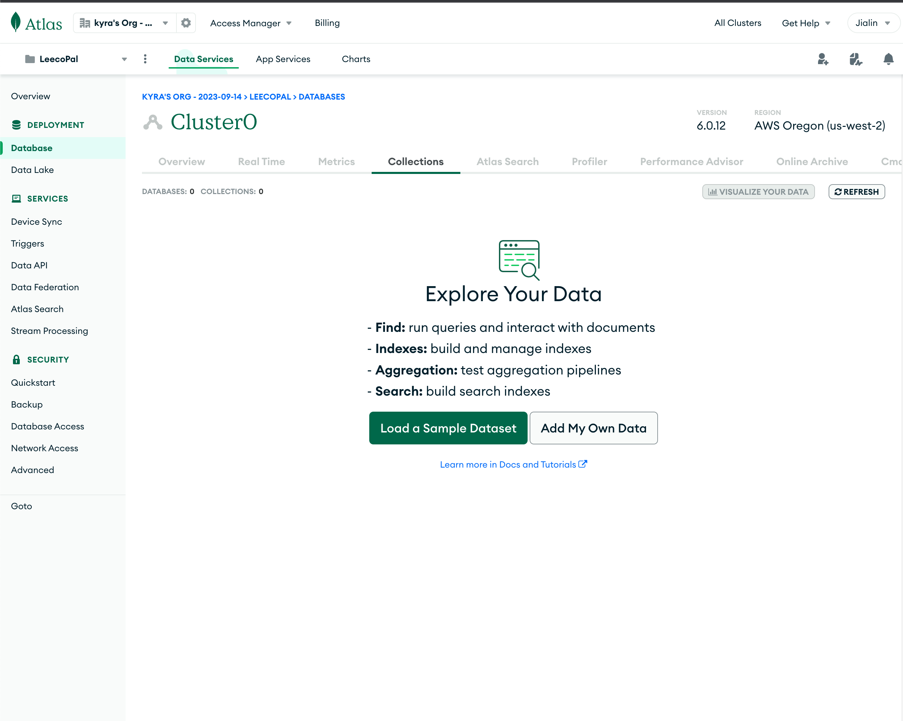
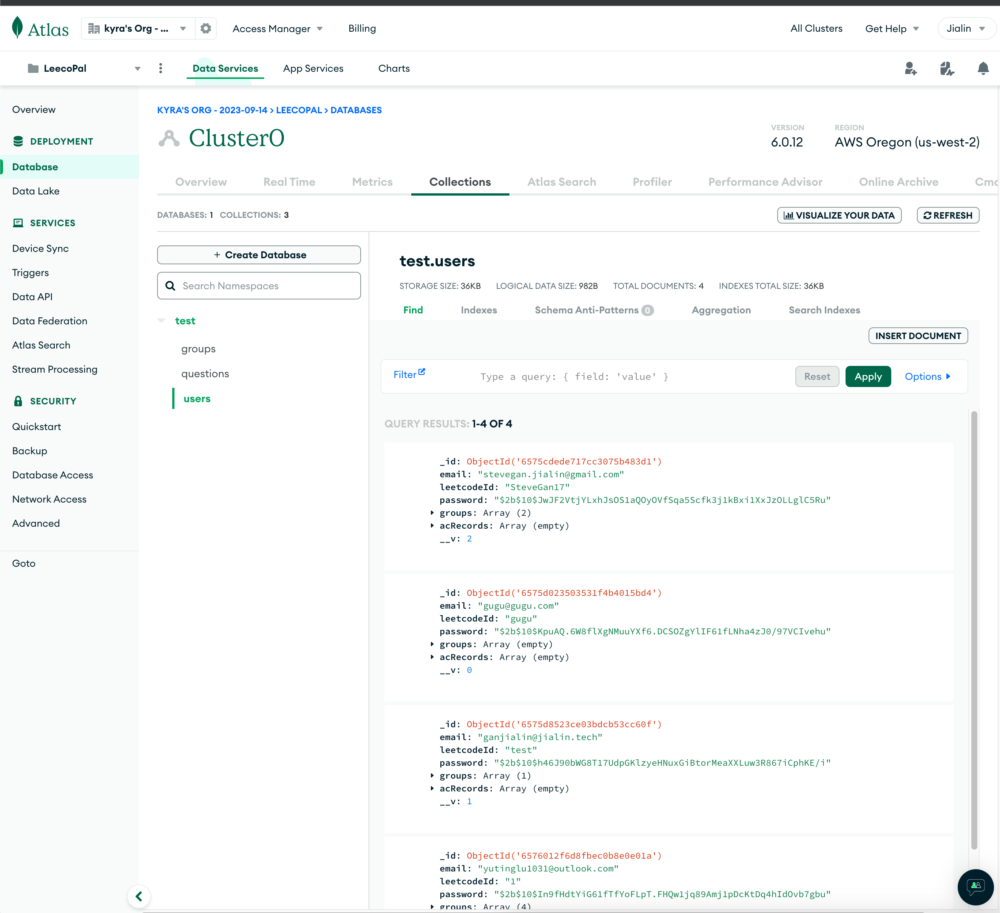

# Final Project 📊👨‍💼💻💬

Your team will utilize MERN to create a useful small web application. You can utilize open-source CSS but it must be cited.

## Part 1 - Requirements

See specification on Canvas.

The same requirements apply:

* Validated your html (at least what it generates) and have included metadata like in previous assignments.
* Test for contrast with a11y.
* Modified the documentation in the program's comments (for the files you edited) to describe the changes you made. Verify that you are well documenting your code using [JSDoc](https://www.npmjs.com/package/jsdoc) standards. You do not need to generate an API.
* Ensured that you write satisfactory unit tests and that your code passes them, with **75%** coverage, but the code you wrote needs to be completely covered. Testing must include mocking.
* Sanatize your database inputs

## Part 2 - Reflection

Update the README to answer the following questions:

 1. Add screenshots showing your app running on Google Cloud. Add a link to your website. Add a screenshot showing the html on your website has been validated. Also one showing proper contrast.

 Link: [https://leecopal.wl.r.appspot.com/](https://leecopal.wl.r.appspot.com/)

 Screenshots:

 
 
 

Validation:

    
 2. Add screenshots showing your Atlas database before and after your app runs.

 Before:
 
 After:
 

 3. Each person: Describe your experience working with your team to complete this project. What is one key learning that you're taking away from this experience? What is one thing that you would change? 

  Jialin Gan: 

  Participating in this team project has been an invaluable opportunity for me to apply and enhance the knowledge I've acquired from previous assignments focused on React and Node.js. This practical application has not only solidified my understanding but has also given me a deeper appreciation of these technologies in a real-world context.

  I am increasingly convinced of the potential of our application. Based on its design and functionality, I firmly believe that it holds significant promise for future growth and profitability. This optimistic outlook is a testament to the dedication and skill demonstrated by each of my team members. Their contributions have been pivotal in bringing our project to its current stage, and I am grateful for their relentless efforts and commitment.

  Reflecting on the process, one area I believe could benefit from improvement is the initial planning phase, specifically regarding the documentation. Clear and detailed specifications laid out before the commencement of the project could significantly enhance efficiency and enable concurrent workflows. This approach would streamline our efforts, ensuring that each team member has a precise understanding of their responsibilities and the overall project objectives from the outset. Implementing this change in future projects would undoubtedly aid in maximizing productivity and fostering an even more collaborative and effective team environment.

  Kyra Lu: It was a comprehensive and collaborative experience for me. One key learning from this experience is likely the importance of integrating front-end and back-end systems effectively. Handling both the user interface aspects and the back-end logic requires a deep understanding of how these elements interact. Ensuring a seamless user experience while maintaining data security and integrity is a critical skill in software development.  If there's something to change or improve upon, it might involve further enhancing the collaborative aspects of the project. There is still some code conflicts even we seperated the work clearly, which may result in some waste of time and repeated work. But overall, I think we did a pretty good job.

  Zhuoxi Wang:Working on our web project as the front-end data display lead was both challenging and rewarding. Collaborating closely with my teammates, I learned the importance of effective communication and timely feedback. Our team's diverse skills and perspectives contributed significantly to the project's success.One key learning from this experience is the value of iterative development. Regularly updating and refining the front-end based on back-end progress and user feedback helped us create a more user-friendly and efficient interface. This iterative approach ensured that we were always moving in the right direction and adapting to changes swiftly.If I could change one aspect of our project, it would be to incorporate more user testing in the early stages. Initially, we focused heavily on technical aspects and functionalities, but integrating user feedback earlier would have provided valuable insights and potentially saved time during later stages of development.Overall, this project was a great opportunity to enhance my technical skills and learn the importance of balancing user needs with technical feasibility.

 4. Explain what parts each team member did. Keep in mind we can see your GitHub commit history. 

    Jialin: User Management, Team Module(frontend + backend), Overall UI, Data Integration 
    Kyra: User Management and Team Interaction 
    Zhuoxi: Data Display

7. Each person: What was the process like working on this full-stack web application. Provide specific examples to help illustrate your experience. 

   Jialin Gan: In my experience woring in this full-stack app, I've found that focusing on one aspect of the project at a time significantly enhances my productivity and efficiency. Initially, I used to switch back and forth between frontend and backend development, which often led to a decrease in my working efficiency due to the constant context switching. However, I later adopted a more streamlined approach. For instance, in the development of a team module, I concentrated first on creating and thoroughly testing the backend using tools like Postman. Only after ensuring its full functionality did I shift my attention to the frontend. This sequential method not only accelerated my development pace but also ensured a higher quality and more cohesive integration between the two sides of the project.

   Kyra Lu: Working on the Leecopal full-stack web application was a multifaceted process, starting with project planning and requirements gathering. We identified key features like team Management, data integration and display as well as registration, login, and a question-answer system. The next phase involved designing the website wireframe. Then designing the database schema for different user accounts, groups and question-answers, creating user-friendly interfaces. Afterwards, we all worked on our side of the project. And in the end, we conducted functionality and  code tests to ensure the operation of the whole project. During the entire process, we also did discussion and communication on a regular basis, which ensures the smooth work of the entire team.

   Zhuoxi Wang:Working on this full-stack web application, where my primary task was to visualize our team's LeetCode practice data, was both intricate and enlightening. I developed a system to fetch each member's LeetCode activity, then used technologies like JavaScript and charting libraries (e.g., Chart.js) to display individual and collective problem-solving trends. For instance, I created interactive line graphs showing each member's daily problem count over time, highlighting trends and active periods. Additionally, I designed an aggregate dashboard to compare activity levels, effectively identifying the most engaged members. This project honed my skills in data handling, visualization, and creating intuitive, user-friendly interfaces. It was a comprehensive experience, blending backend data integration with meaningful front-end presentations.
